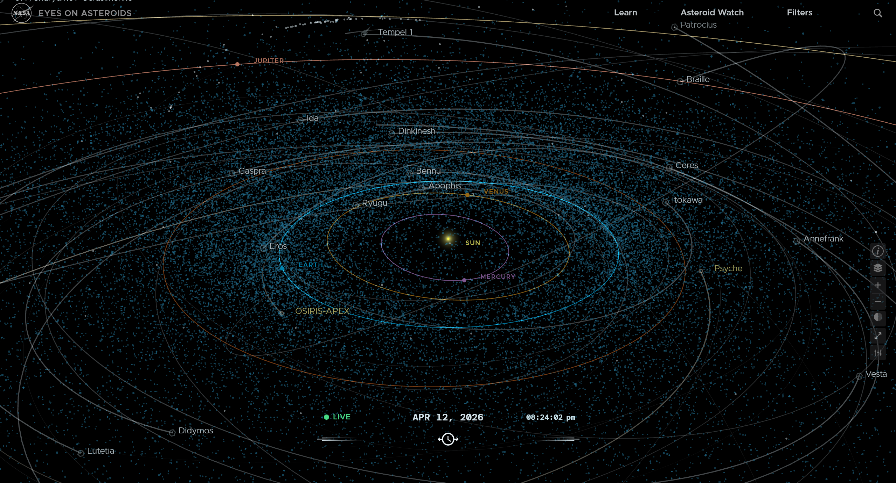
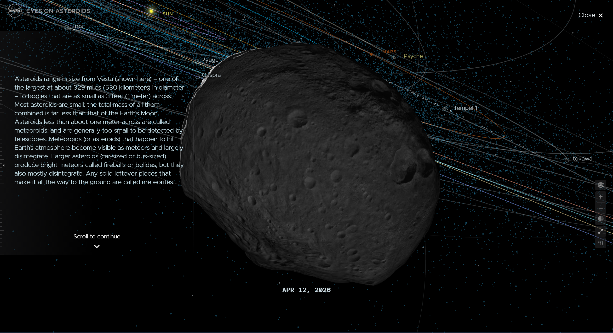
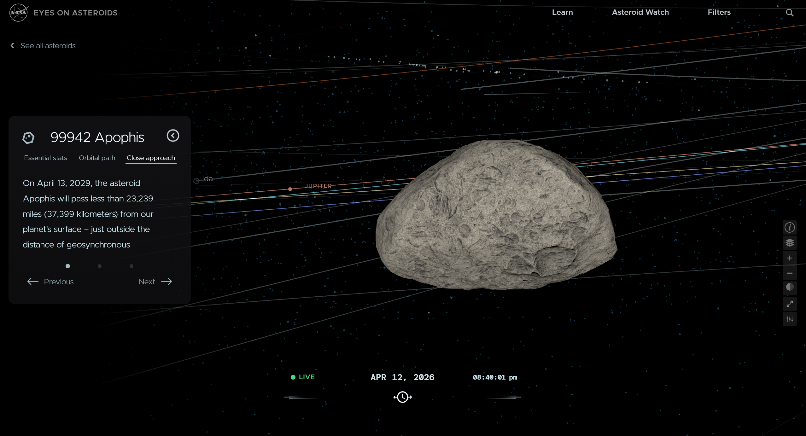
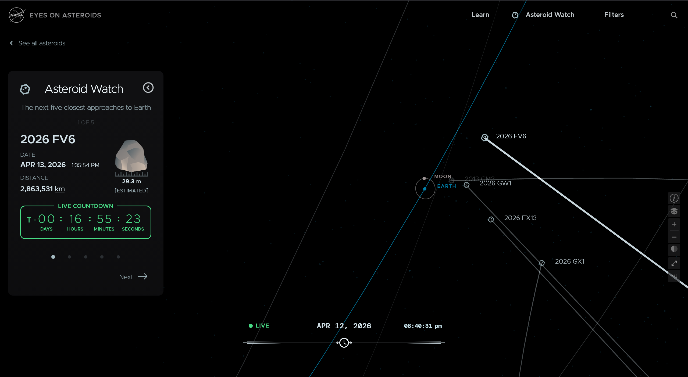

# Vis in the Wild: NASA's Eyes on Asteroids

For as long as I can remember, I have been intrigued by outer space. At first, my fascination came from a childlike sense of wonder, drawn to something far greater than myself, something mysterious and awe-inspiringly beautiful.  
As I grew older, that fascination grew with me into a scientific curiosity. In the grand scheme of the universe, we are smaller than specks, yet so much of it remains uncharted and unknown.  
After many nights spent gazing upward, a couple of elective astronomy courses, and an ongoing interest in books, movies, and video games set in space, that curiosity has only deepened. And somewhere deep within that curiosity, I can still find the younger version of myself, content to sit, look up, and marvel at the beauty of it all.

When asked to find and analyze an interactive data visualization, I was quick to pick out *NASA's Eyes on Asteroids.* This application is part of *NASA's Eyes* series, developed to provide helpful, visual learning experiences about space.  
The primary purpose of *NASA’s Eyes on Asteroids* is to make complex astronomical data accessible and engaging for a general audience through an interactive, story-driven visualization. It allows users to explore comets, asteroids, and spacecraft missions within our solar system in a dynamic and intuitive way.

## Data and Sources

The data presented in this visualization includes the orbital paths, classifications, sizes, and trajectories of asteroids and comets within the solar system. This information is collected by NASA through a combination of ground-based telescopes, radar observations, and space missions. These datasets are continuously refined as new observations are made, allowing the visualization to reflect current scientific understanding.

## Audience

This application is geared toward the general public: anyone with an active interest in space, specifically the asteroids and comets found in the solar system, but without advanced scientific training.  
Rather than functioning as a complex scientific dashboard, the application feels more like a virtual museum exhibit. It includes curated highlights of specific asteroids, comets, and missions, along with explanatory content that helps users understand what they are seeing. These design choices make the tool approachable while still being informative.

The images below demonstrate some of these features, including guided tours, detailed object views, and a display of near-Earth asteroids.

In addition to the features described above, the application does place some control in the users' hands, like filters to select between comets, asteroids, and potentially hazardous objects, controls to fine-tune the view, and a slider at the bottom of the page to move through time.

## Questions and Insights

This visualization enables users to explore a variety of questions about the solar system, such as: which asteroids come closest to Earth? What qualifies an object as "potentially hazardous," and how many are there? How do objects move through space over time?

For example, users can identify near-Earth objects like Apophis and track their paths relative to Earth over time. They can also observe patterns in the locations of asteroids and comets throughout the system. I think the time controls are especially valuable, not only to show views at different points in time but also to allow the user to view the motion of objects through time. 

## Design and Interaction Choices

From a design standpoint, this application works well. The labels are clear, the map's controls are intuitive, and the interactable objects are clearly visible and highlighted. The inclusion of guided tours and contextual information on demand supports user understanding while also encouraging further exploration.

One complaint I have is with the visual density of the map. Without any filters selected (which is the default view), the map of the solar system is filled with blue dots representing all of the comets and asteroids, so many that the important elements of the visualization become obscured. Given the fact that these points are un-interactable and what I discerned to be the purpose of this application, I think it would make more sense to hide these points by default or dim them more so that the important pieces can be clearly seen.  

Similarly, given that the purpose of this application is to provide a guided tour throughout the important comets and asteroids in the solar system, I think that the guides should be easier to find. The guides are contained in a "Learn" menu in the top right of the screen that most people probably wouldn't bother to click on. Making them more visible and central to the focus of the application would boost engagement and support the main purpose of the visualization.

## Limitations

While the visualization is effective for the general public to explore and learn, it does have some limitations. It doesn't allow users to interact with the full dataset of over 1.3 million known asteroids and comets. The tools and filters are basic and don't support advanced queries. The guided, museum-like approach restricts the user from freely exploring. 

## Conclusion

*NASA's Eyes on Asteroids* transforms complex data into an engaging and accessible learning experience. It combines storytelling and interactive tools to allow for some exploration and guided learning. There are some ways the application could be refined, but overall the application achieves its goal of making space exploration approachable to a wider audience.  

In many ways, it captures the same childlike sense of wonder that first sparked my interest in space, while also providing the tools to understand more about it.
