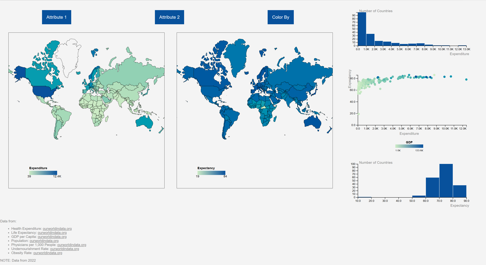
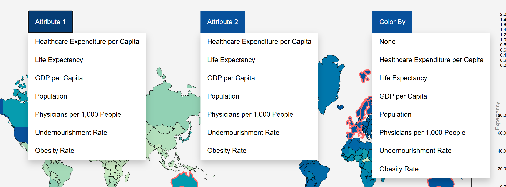
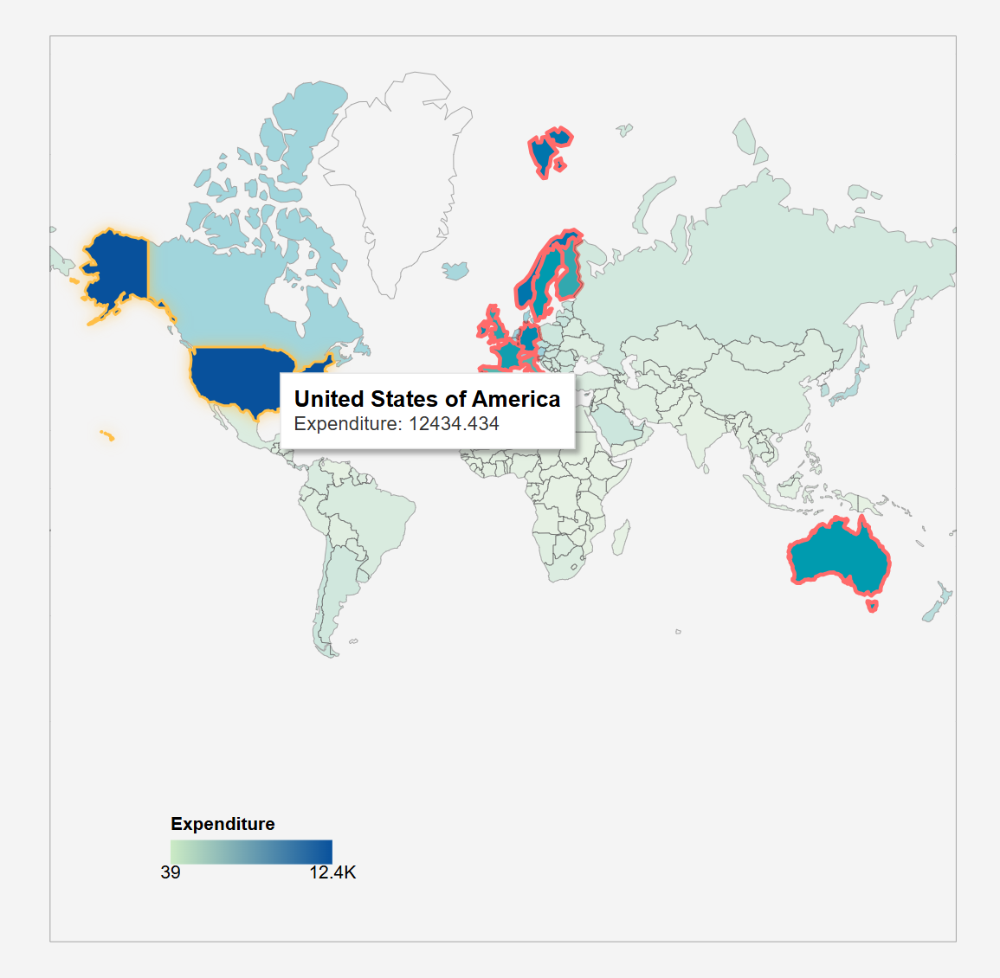
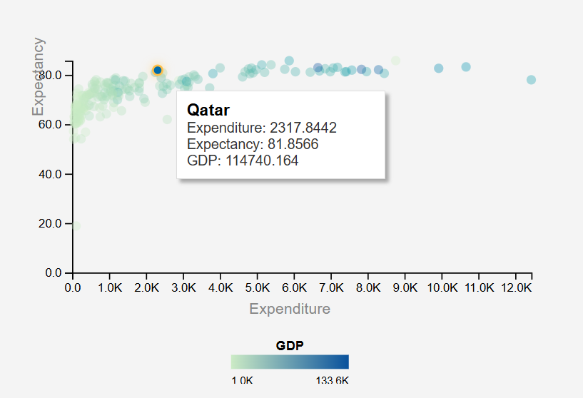
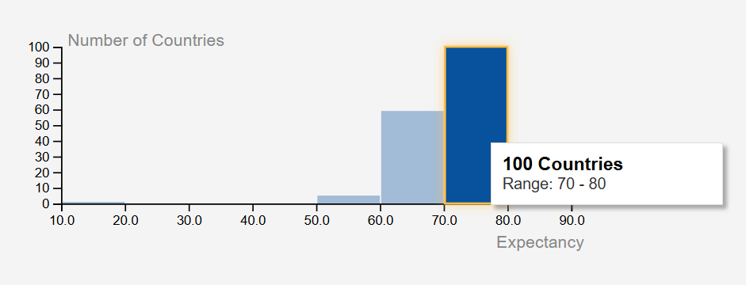
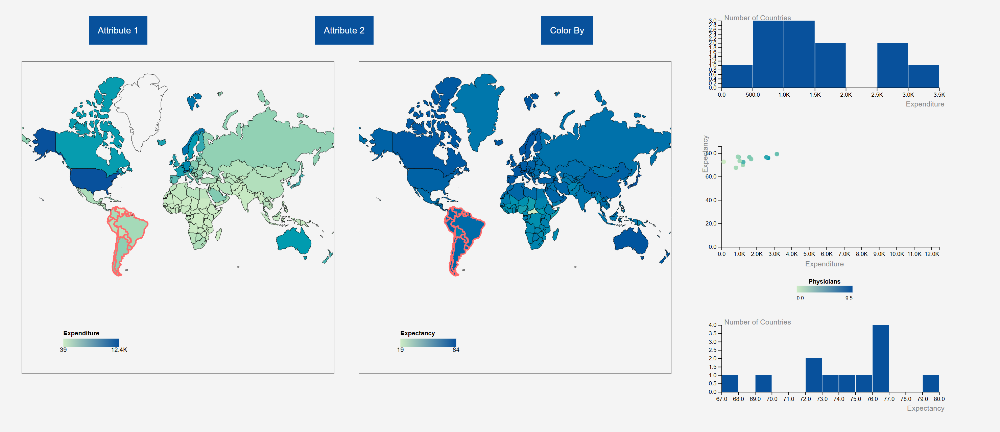
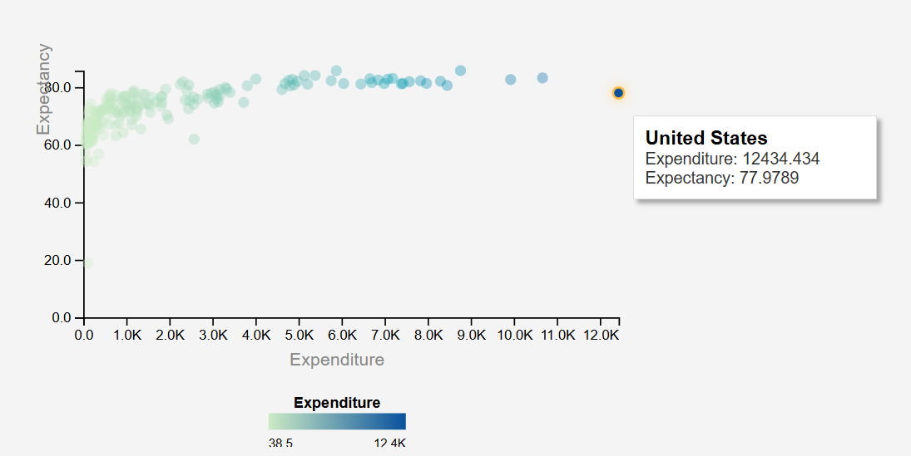
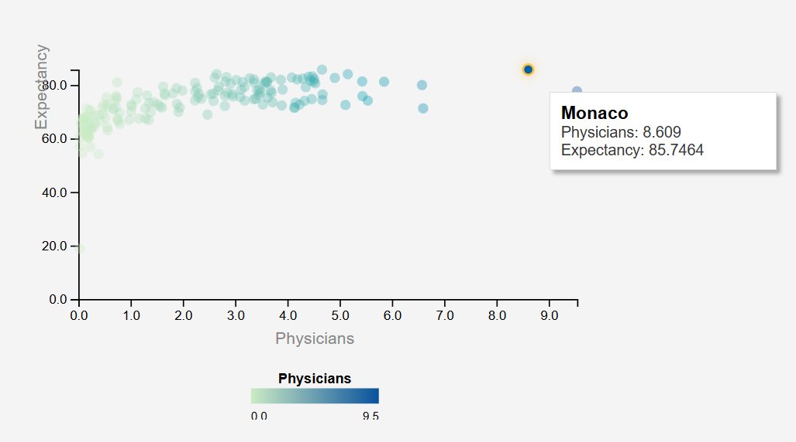
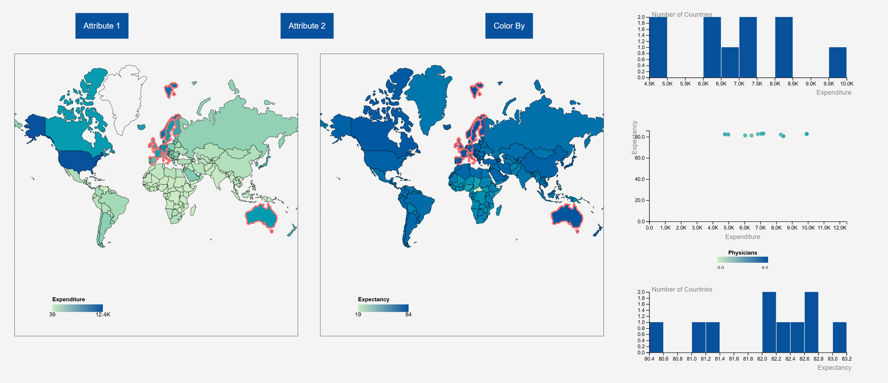

[Home](README.md)

# Vis Project 1: Health Outcomes Dashboard

The initial goal for this project was to create a dashboard application that allowed the user to explore data on healthcare outcomes across the globe. I wanted to include data to describe healthcare systems as a series of inputs and outputs. To start, I chose to examine the relationship between Healthcare Expenditure per Capita and Life Expectancy. As the project grew, I expanded to include different datasets that might help explain a nation’s healthcare system or health outcomes as a whole: GDP per capita, the number of physicians per 1000 people, or undernourishment rates to name a few examples. This application gives the user the freedom to select between multiple related datasets and explore the relationships between all of them, encouraging individuals to derive their own data-driven conclusions.

## The Data

All the data for this project was taken from Our World in Data: https://ourworldindata.org  

All data is from 2022, as the most recent available year for each chosen attribute. Here is a list of the data attributes included in the project:

- Health Expenditure per Capita  
- Life Expectancy  
- Population  
- GDP per Capita  
- Undernourishment Rates  
- Obesity Rates  
- Physicians per 1000 people  

Not all countries have available data for each attribute. Where possible, those who collected and published the data filled in missing points with data from earlier years or with projections. To find the specific pages for each attribute on Our World in Data, see the references section at the bottom of the application.

## The Dashboard

The dashboard application contains five different visualizations: two histograms, two choropleth maps, and one scatterplot. The two histograms represent the two user-chosen attributes, defaulted to Healthcare Expenditure and Life Expectancy, respectively. Each histogram contains bins of the possible values for the chosen data, with each bar representing the number of countries that fall within that bin. The two maps display this same data in a different way, coloring each specific country based on the value of the attribute. Finally, the scatterplot describes the relationship between the two attributes in one plot, placing one on either axis. Few an image of the full dashboard application below.

The application also has three dropdown buttons:

- **Attribute 1** – allows the user to choose the attribute displayed by the first map and histogram as well as along the x-axis of the plot.  
- **Attribute 2** – uses the same logic for the other map and histogram and the data plotted on the y-axis.  
- **Color By** – allows the user to select a third attribute to color the points of the scatterplot with, following the same color scheme as the map.

Each visualization contains detail-on-demand interactions. Hovering over a bar on either histogram shows the specific number of countries represented. Hovering over a country on either map returns a tooltip with the attribute’s value for that country, and clicking on any country will filter the other graphs to only include data from the selected countries. Hovering over a point on the scatterplot shows up to three values: the value for both axes and a potential third attribute if selected.

  
  
  

## The Findings

When I started this project, I guessed that the United States would be an outlier in terms of Healthcare Expenditure. That hypothesis turned out to be correct. While being middle of the pack in terms of life expectancy at around 77 years, the US featured the largest Expenditure values by far at about $12,500 per person. There are certainly many factors that effect Life Expectancy beyond just the quality of Healthcare, but having such high expenditures with no clear better outcome begs the question: Is the USA's Healthcare system inefficient?

Qatar has relatively low Health Expenditure, but one of the highest Life Expectancies. This is difficult to see when just looking at these two attributes because there are a high number of countries with low Healthcare Expenditures, so they are hard to pick out on the plot. Also because, for most countries, the Life Expectancy values are quite similar. When I talk about Qatar being on the higher end, I mean by a couple of years. The "Color By" feature helped me see that it also boasts a very high GDP per capita, making it stand out as a rich country that requires less money spent on Healthcare, while still outputting high Life Expectancy. From these findings, it seems like a good system worth looking into in greater detail.

Monaco is also an interesting outlier due to its high Life Expectancy and high Number of Physicians per 1000 people.

Finally, I noticed that the Western European countries tend to have the highest Life Expectancy for their people. When filtering from the map, it's clear that they still require significant input in terms of Expenditure, but not as much as some other nations. From this viewpoint, it seems like Western Eurpoean countries have high quality healthcare at more affordable costs. They might be worth looking into more as potential for some of the most cost-effective Healthcare systems.

## The Process

The only library used in the development of this application was JavaScript’s D3.

I used GitHub throughout the development process to contain my code and manage its iterations. The publicly hosted repository can be found at this link:

https://github.com/isaac-dowdy/health-outcomes-dashboard

The files are structured into three folders: `data`, `js`, and `css`.  
- The `data` folder holds my GeoJSON data and CSV data.  
- The `css` folder holds my singular style sheet.  
- The `js` folder holds all of my JavaScript code.  

Each visualization has its own JavaScript file and associated class, with one file for `main` to load the data and initialize everything, as well as a file for D3.

The code for the project was written inside Visual Studio Code, which integrates nicely with Git. Any time I wanted to glance at the preview, I used the Visual Studio extension “Live Server” by Ritwick Dey that opens my HTML file in a browser and updates with any edits I make to the code – this was super helpful to view any changes I made in real time.

Now, the dashboard application is publicly available at this link:

https://health-outcomes-dashboard-page.vercel.app/

## The Challenges

I encountered quite a few challenges throughout the project. Aside from the in-class work leading up to this project, this was my first hands-on experience with JavaScript, HTML, and CSS. Beyond that, it was my first hands-on experience with web app development or any kind of front-end development. The process of becoming familiar with these new languages and style of development was a challenge by itself; I found myself frequently consulting outside resources to remind myself of the basics of each language.

I encountered plenty of technical bugs throughout development, especially with choropleth maps and the selection filtering functionality. I also had difficulty with loading the data initially due to the finer details of JavaScript typing that caused bugs I didn’t catch until later.

Now that I’ve worked through those challenges, there are still remaining flaws and issues I experienced that are still evident. I am not a designer. So, the process of creating an application that is visually interesting posed a challenge, but more than that, I struggled with keeping the user experience at the front of my mind. As the developer of this application, I know exactly how it works and how to operate it. However, that’s not the case for most users who might stumble onto the page. I don’t think I put enough thought into how to explain the elements on the page and how to interact with them. I wish that I had put more descriptive effort into the project and spent more time thinking about how someone else might interact with the application. If I were to come back later and work on this project more, this is where I would start.

## AI Use

AI was used to help with this project. I would estimate that it helped with 25–35% of the effort. I used ChatGPT to ask high-level questions about web development, JavaScript, and Git that I needed help with. It helped me brainstorm and generate some good guiding questions as I was trying to pick which attributes to develop around. It directed me to the VS Code extension I mentioned earlier and helped me understand and dissect the DOM when I was troubleshooting bugs.

I also found ChatGPT to be good at editing HTML files, so whenever I wanted to try out a shifted layout, I would describe the changes I wanted to make, paste in my current HTML, and let it move things around. Chat is also good at writing Markdown, which I am unfamiliar with, so it helped me translate this from a Word document into a GitHub README.

I mentioned that I used Visual Studio Code, which is now integrated with GitHub Copilot. Copilot offered line-by-line suggestions as I typed that were surprisingly good at guessing what I wanted to write next based on what was already typed. This saved a lot of time typing, but it also offered new ideas I hadn’t thought of and helped me problem solve. Copilot also has a chat window directly inside the IDE that can view all of the code currently open and make direct edits upon request, but I didn’t love this functionality because it moved too quickly and tried to edit too many files at the same time, leaving me confused and unable to accurately judge the quality of its generated code.

## Demo

  <iframe 
    width="800" 
    height="450" 
    src="https://www.youtube.com/embed/7p8N7JQhl00"
    title="Health Outcomes Dashboard Demo"
    frameborder="0"
    allowfullscreen>
  </iframe>

  
