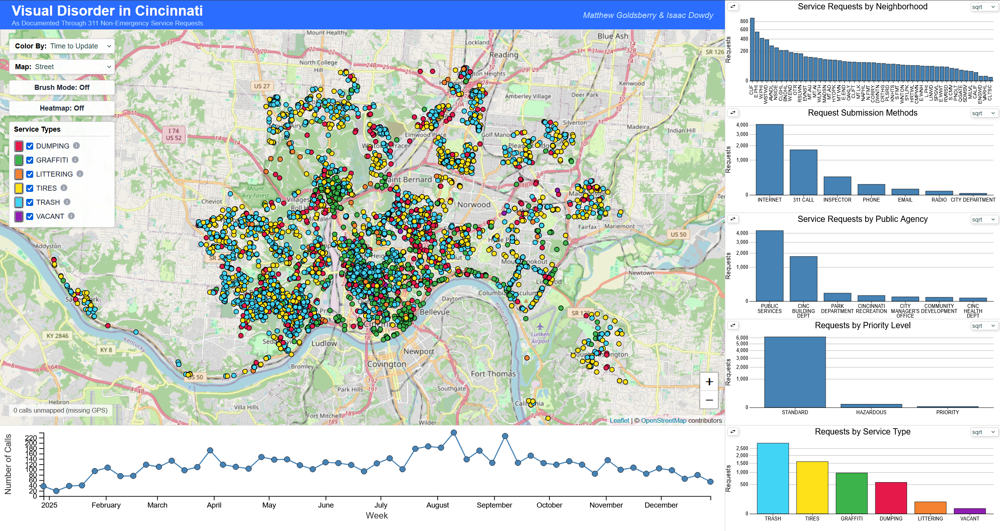
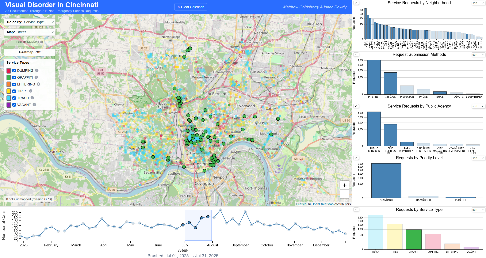
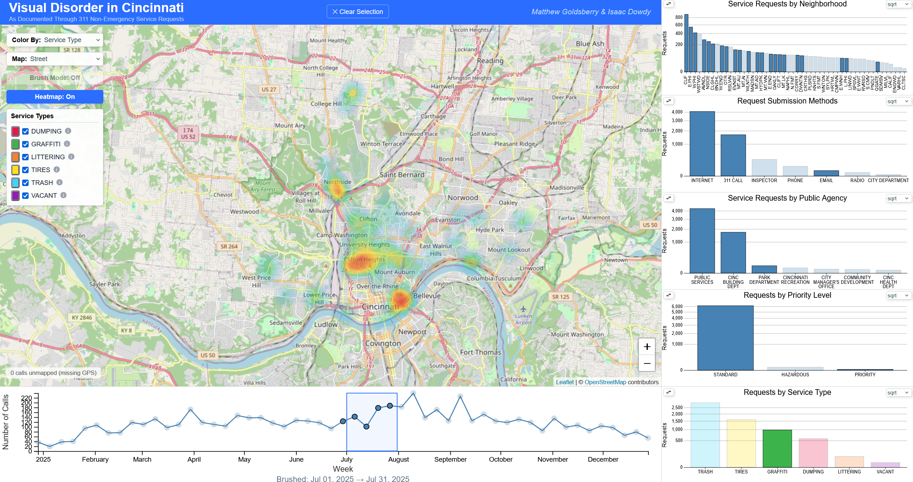
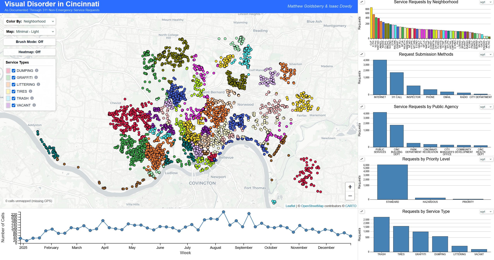

[Home](README.md)

# Vis Project 2: Who You Gonna Call? 3-1-1!

The goal of this project was to create a dashboard application that allows users to explore data on 311 calls made to the City of Cincinnati in 2025. 311 systems serve an important role in creating a space for citizens to share their needs and report issues to the government. Visualizing this data helps show the geographical distribution of requests, providing an accurate picture of which areas of the city experience different kinds of reports and how the City of Cincinnati works to handle these requests.

For this project, we focused on a subset of this data in the realm of "Visual Disorder," including 311 service requests such as graffiti removal, litter cleanup, and reports of vacant buildings. We chose this subset so that we could hone in on a smaller, more manageable amount of data while telling a consistent story throughout the dashboard. These requests tell an interesting story because they reflect the level of neighborhood maintenance and the wellbeing of the community. Issues that fall into this category often influence how residents view the cleanliness and safety of their neighborhoods.

Ultimately, this dashboard is designed to provide an intuitive way to explore the data and draw meaningful inferences from it. One focus of this project was creating linked interactions across the different charts and map views to give users more granular control over what data is being visualized and how it is presented. Users can quickly identify trends in the data and draw comparisons by isolating certain neighborhoods, request types, or subsets of time.

## The Data

## The Sketches

## The Dashboard

The dashboard application contains seven different visualizations: the map view, five bar graphs, and a timeline. The map shows the City of Cincinnati with the service requests geographically visualized. The five bar graphs show number of service requests by neighborhood, request submission methods (Internet, 311 Call, etc.), number of service requests by public agency, service requests by priority level, and requests by service type (Trash, Tires, Graffiti, Dumping, Littering, and Vacant). View an image of the full dashboard application below.

Each visualization contains detail-on-demand and linked interactions. For example, hovering over a bar on one of the graphs will show a tooltip with more information while also highlighting the corresponding data on the map and timeline. Clicking on this same bar will specify this highlighted data to persist, allowing the user to select more filters to drill further down into the data. These interactions also work for the Leaflet map and the timeline. When the user makes any selection, a button appears at the top of the page to clear the selection in one easy step.

Furthermore, both the timeline and the Leaflet map include brushing features that allow the user to select a set of service requests. Although the timeline is binned by week, the brush allows the user to select by the day, providing a helpful tooltip at the bottom of the screen showing which dates have been brushed. Both the map brush and the timeline brush work together with the linked interactions described above. To give two example use-cases, the first picture below visualizes all of the graffiti requests made in the month of July. The second picture shows all of the service requests made by a 311 call in the area surrounding the University of Cincinnati.

The map contains an option to view the data through a heatmap. The heatmap functions seamlessly with the linked interactions described above, always showing the same data visualized by the leaflet map, just with a different method. The two images below are the same exact example scenarios described above but depicted through the heatmap.

The Leaflet map also includes some view options surrounding the map background, the color of the nodes, and a service type selector. The image below shows some of these options in use, note how the bar graphs change colors to indicate which attribute is currently colored.

## The Findings

## The Process

## The Challenges

## AI Use

## Division of Work

## Demo

  <iframe 
    width="800" 
    height="450" 
    src="https://www.youtube.com/embed/7p8N7JQhl00"
    title="Health Outcomes Dashboard Demo"
    frameborder="0"
    allowfullscreen>
  </iframe>

  

