# The Fellowship of the Script: An interactive visualization of LotR dialogues

**Team Members:** [Matthew Goldsberry](https://github.com/MatthewGoldsberry) & [Isaac Dowdy](https://github.com/isaac-dowdy)

**Links:** [Live Application](https://the-fellowship-of-the-script.vercel.app/) | [Source Code (GitHub)](https://github.com/MatthewGoldsberry/Movie-Time) | [Demo Video](#video-demonstration)

---

## Project Overview & Motivations

This project is focused on creating an interactive visualization to explore data from the Lord of the Rings Extended Edition films.

* **The Problem:** The data for this project was located on a fan-made website. Part of the challenge was to scrape and process this data, creating our own data files to work from. The project guidelines also allowed for a lot of creative freedom for this project, so it was up to this team to decide how to visualize and represent this data given a set of loose instructions.
* **The Goal:** The goal of this application is to not only create a dashboard that is informative and allows the user to make conclusions about the dialogue from the Lord of the Rings films, but also to create an interesting, engaging experience that brings the user into the Lord of the Rings universe, driving curiosity, exploration, and appreciation of this fantastic work of literature and film.

## Video Demonstration

<figure markdown="span">
  <video controls loop muted playsinline width="700">
    <source src="https://github.com/MatthewGoldsberry/portfolio/releases/download/v0.0.3/The.Fellowship.of.the.Script.Demo.mp4" type="video/mp4">
    Your browser does not support the video tag.
  </video>
</figure>

## The Data

The datasource for this project was taken from this website: [Lord of the Rings Transcripts](https://www.tk421.net/lotr/film/), which includes each movie broken down with links for each scene (32 scenes per film). Each scene page includes all dialogue attributed to the speaking characters, alongside bracketed stage directions, scene locations, and various pictures from the films. The transcripts are taken from the three Extended Edition Lord of the Rings films.

A large part of this project was the data collection. Since we started with just a website, this process looked like developing python scripts to scrape, process, and organize this data into a CSV file - more information on the technical details of this process can be found below in the [Technical Implementation section](#technical-implementation) or the [Python script](https://github.com/MatthewGoldsberry/Movie-Time/blob/main/data/data-pipeline.py) used. Additionally, as part of this project we chose to visualize character locations on a map of Middle Earth. This presented another data collection hurdle: translating listed scene locations into coordinates on the map. In addition to the above website, this [Interactive Map of Middle Earth](http://lotrproject.com/map/#zoom=3&lat=-1319&lon=1500&layers=BTTTTT) proved useful in decoding some of the scene locations.

## Design Process & Early Sketches

At the start of the project, we established a requirement for ourselves: the map of Middle Earth should serve as the persistent backdrop for the entire application, with all other content layered on top. This constraint shaped nearly every design decision that followed.

### Initial Concept

With all the data that needed represented in the project, a deliberate strategy had to be designed to arrange everything spatially. To address this we decided to put as much as we could in the "dead spots" of the map, areas where the characters would not travel close to, and have information hidden behind expansion modules that have to be opened. Those would be the main locations for a lot of the more specific data visualizations.

### Sketches

With these constraints in mind, we developed two early sketches to explore potential spatial arrangements, focusing primarily on map zoom level.

#### Approach 1: No Zoom


#### Approach 2: More Zoom

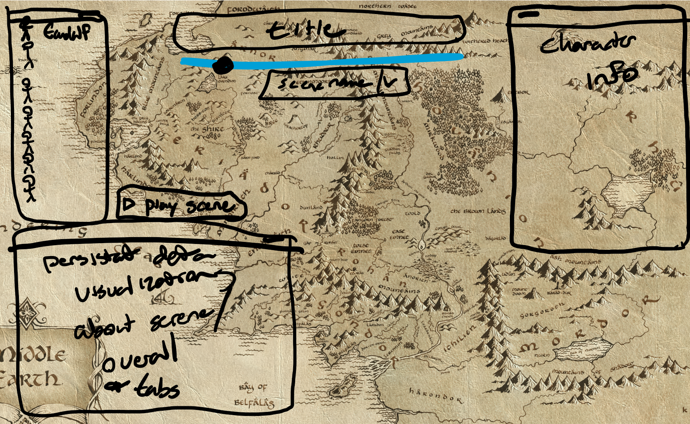

#### Decision and Validation

We choose Approach 1. The zoomed-in view sacrificed too much of the map's visual impact and made it significantly harder to place UI elements without covering important geographic areas. The full-scale view preserved the aesthetic of the map while giving us more usable negative space for the interface.

### Color Design

Color design centered on one primary constraint: staying visually consistent with the aged tone of the map. This intent is reflected throughout the application's color palette.

For character colors, standard high-contrast categorical palettes felt too jarring against the muted map tones. We developed a custom set that *loosely* matched colors associated with each character while naturally grouping the four hobbits within a shared color family. Colors used within the visualizations themselves are slightly more saturated than the character node colors to maintain legibility against the darker backdrop elements.

## Visual Components & Interactions

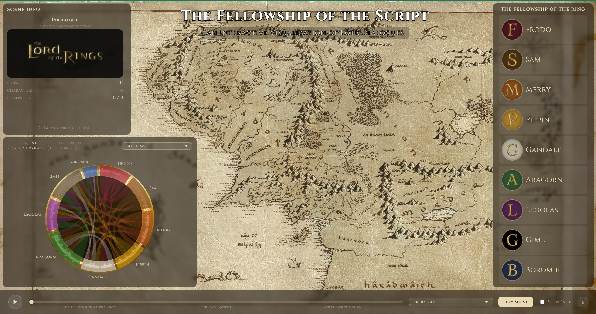

### Middle Earth Map

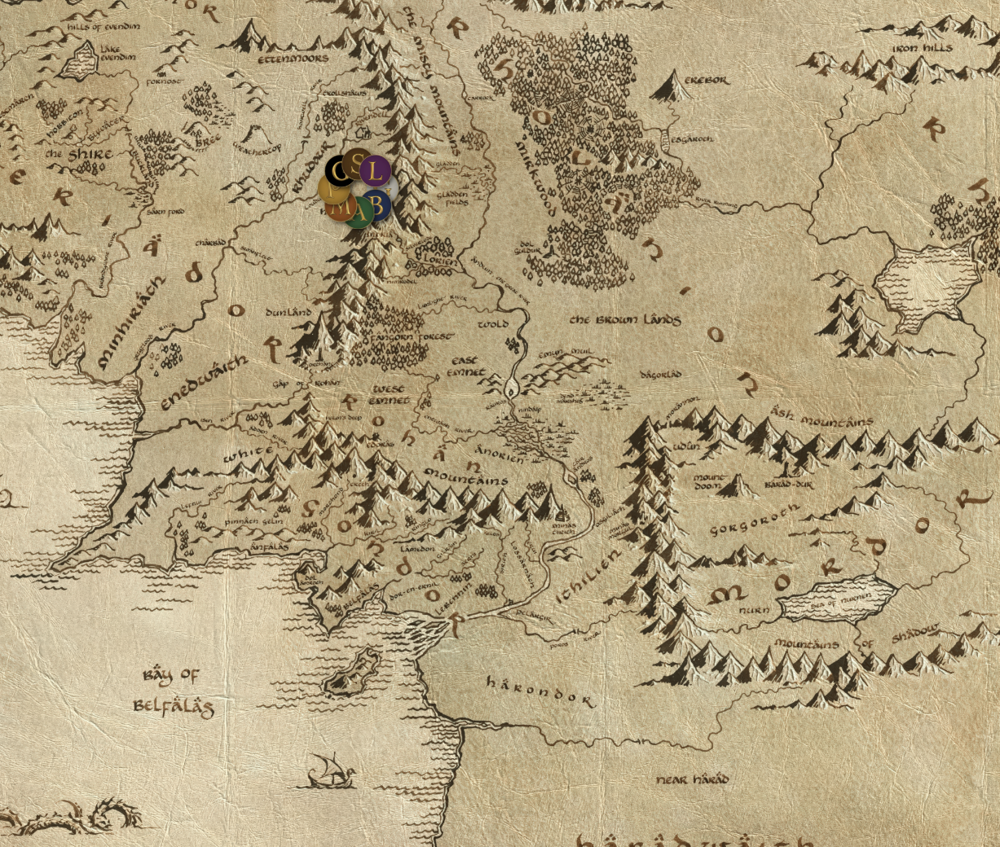

**What this shows:** The locations of each member of the Fellowship (Aragorn, Boromir, Legolas, Gimli, Gandalf, Frodo, Sam, Merry, Pippin) in each scene where they have dialogue. Character locations are represented by colored letter icons distinct for each character and correlated to the color used for that character throughout the application. If enabled, the map also shows colored character paths for each scene leading up to the selected scene.

**Interactions:** The user can hover over a character icon to view their specific path (enabled) in isolation to the rest. Clicking on one of these icons shows their information in the panel at the top left of the dashboard.

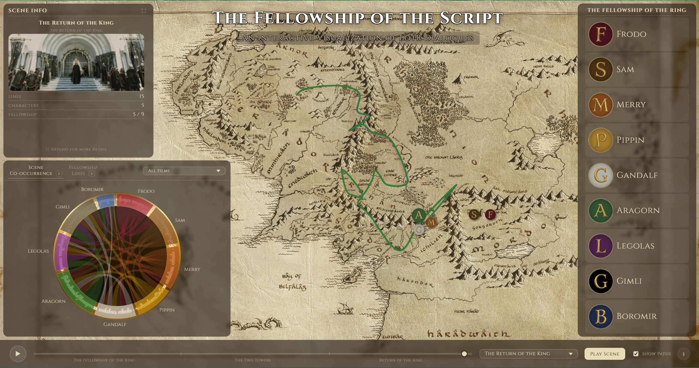

### Scene Controls


The scene control panel at the bottom of the application contains five different components: the scene slider, dropbox, play scene button, play film button, path toggle, and info button.

#### Scene Slider

**What this shows:** A line and point cursor with segments for each scene across each film to select specific scenes by location in the films.

**Interactions:** The user can click and drag the point across the line to select different scenes. The selected scene will populate across the map and info panel.

#### Scene Dropbox

**What this shows:** A dropbox to select specific scenes by title.

**Interactions:** The user can click on the box to expand it, scroll through the list, and select a scene which will populate across the map, scene slider, and info panel.

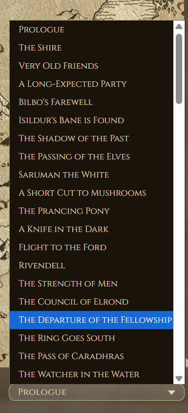

#### Play Scene Button

**What this shows:** A button in the scene control panel titled `Play Scene` that toggles to `Stop Scene` on click.

**Interactions:** On click, this button calls a function that steps through the CSV data for the chosen scene, showing text boxes that appear above each character on the map. Clicking again will stop this process.

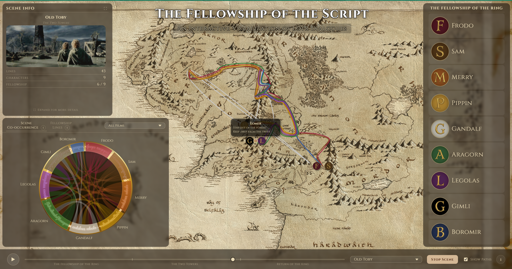

#### Play Film Button

**What this shows:** A play button on the left side of the scene control panel. On click, it morphs into a pause button.

**Interactions:** On click, this button steps through each scene starting at the chosen scene, displaying scene information and visualizing character locations on the map. Clicking again will stop this process.

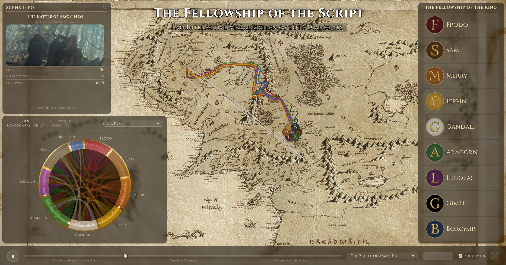

#### Path Toggle

On click, this button toggles between showing/hiding character paths on the map. Character paths appear the same color as their node color, consistent throughout the application, tracking the movement of each character throughout the scenes where they have dialogue.

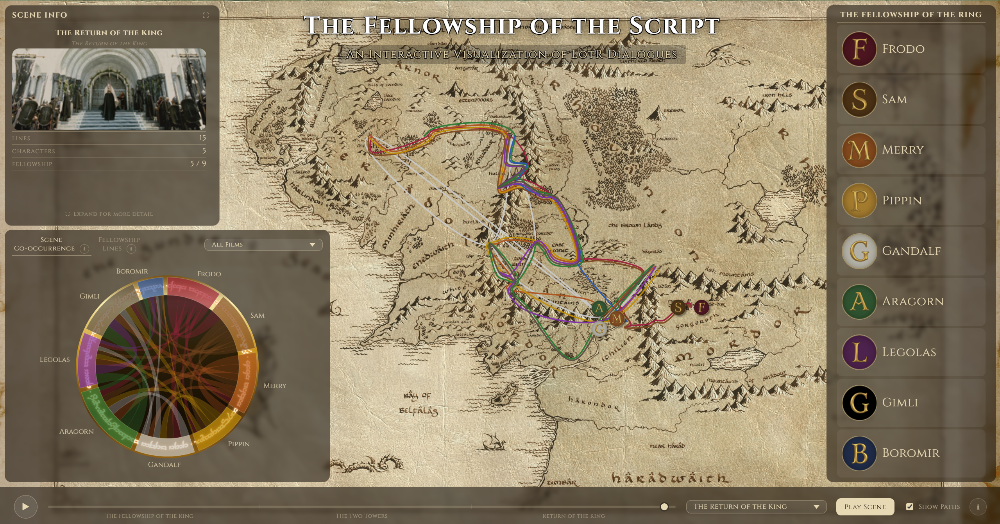

### Info Button

The info button at the bottom right of the application calls a pop-up on hover or click to show information about the films, the data used in the project, and other acknowledgements.

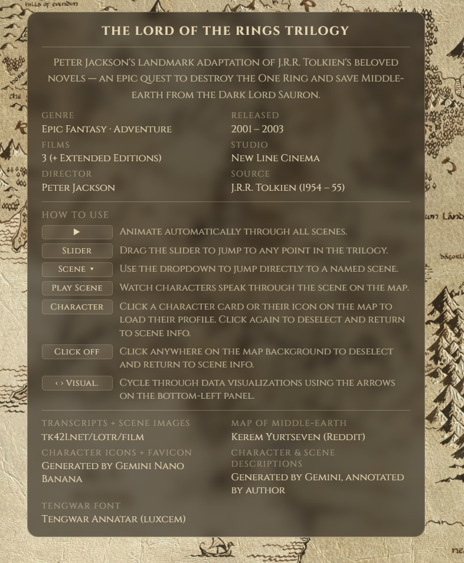

### Scene Co-Occurrence

**What this shows:** This shows the relationships between characters and their scene appearances with each other and throughout the movie.

**Interactions:** On hover of arcs, the visualization will emphasize the interactions connected to the arc (ribbons), and a tooltip will show how many scenes the character had lines in. Clicking will persist this selection. On hover of ribbons, the tooltip will show the relationship of how many times characters shared scenes. The dropdown allows for filtering by movie.

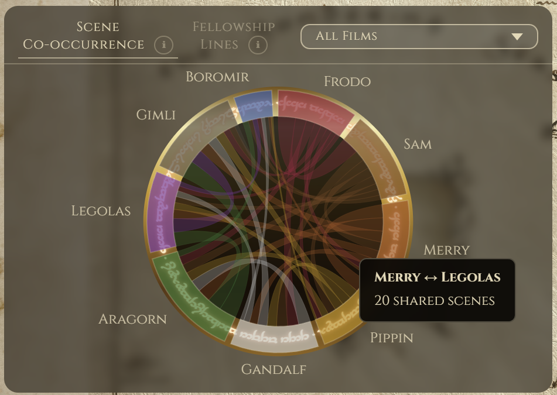

### Fellowship Lines

**What this shows:** This shows the how many lines each of the characters in the fellowship spoke over the movies.

**Interactions:** On hover, the visualization will emphasize the bar and display a tooltip. The dropdown allows for filtering by movie.

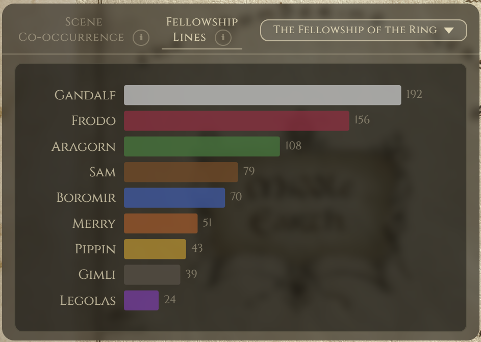

### Scene Info (Minimal View)

**What this shows:** Basic scene dialogue stats.

**Interactions:** Clicking expand button or text will open the [Scene Info (Expanded View)](#scene-info-expanded-view).

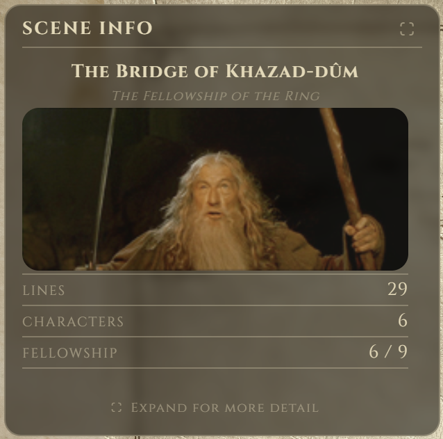

### Scene Info (Expanded View)

**What this shows:** Advanced Scene dialogue stats. This includes the number of lines each character spoke and the full dialogue.

**Interactions:** Clicking on the section titles or carets allow for the expansion / collapsing of those sub sections. On hover over the bars, the bar will be emphasized and a tooltip with information will appear.

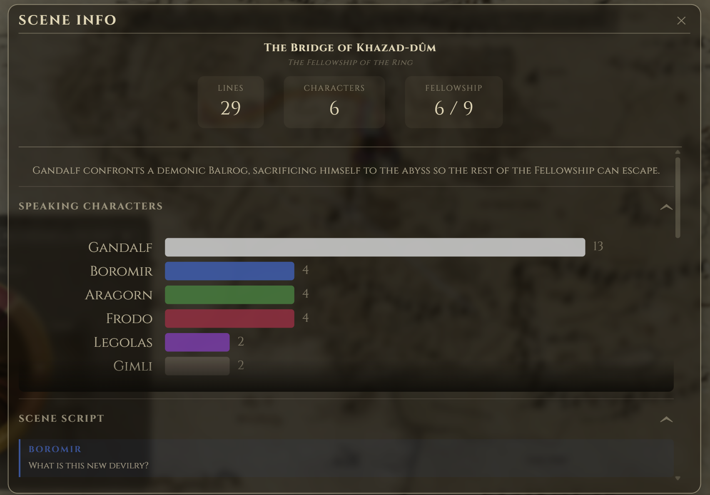

### Fellowship Character Panel

**What this shows:** All of the characters in the fellowship with their corresponding icons.

**Interactions:** On click, selecting a character will trigger their specific info panel to appear in the top left.

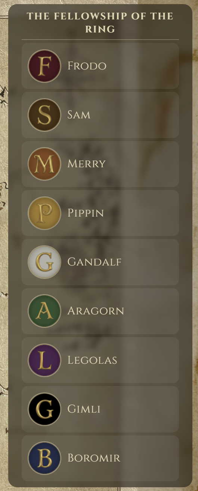

### Character Info (Minimal View)

**What this shows:** Basic character dialogue stats.

**Interactions:** Clicking expand button or text will open the [Character Info (Expanded View)](#character-info-expanded-view).

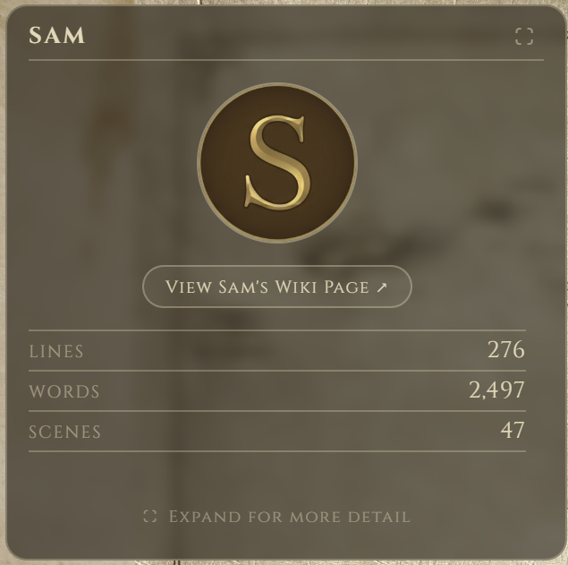

### Character Info (Expanded View)

**What this shows:** Advanced Scene dialogue stats. This includes the number of lines each character spoke and the full dialogue.

**Interactions:** Clicking on the section titles or carets allow for the expansion / collapsing of those sub sections. On hover over the bars, heatmap bins, or words in the cloud, that point will be emphasized and a tooltip containing additional information will appear. Selecting the wiki page button will redirect to an external wiki page about the character. The `Top Words` visualization has three different modes of representing word occurrence, `Most Used`, `Most Frequent`, and `Most Unique`.

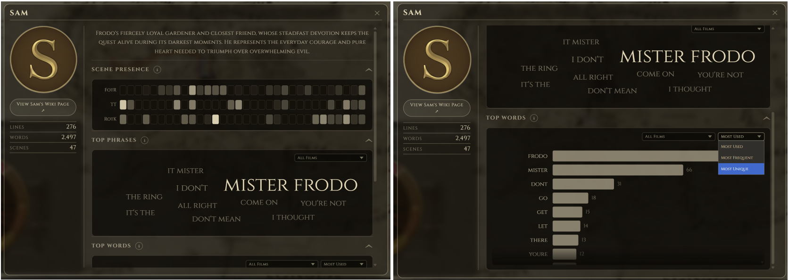

## Key Discoveries & Findings

### Different Narrative Lines

One thing that the Lord of the Rings franchise accomplishes very well across the books and films is the intricate character development, especially for the nine members of the fellowship, and the multiple distinct subplots woven into one story. These different narrative lines and interactions between different characters is something that can be clearly seen when using this application.


The paths feature is helpful to see which characters travel together and frequent the same areas on the map. For example, it shows the clear connections between Frodo and Sam, between Merry and Pippin, Pippin and Gandalf, as well as Legolas, Aragorn, and Gimli. In fact, these connections reflect the intricate subplots throughout these films: Sam and Frodo on their travel to Mount Doom in Gorgoroth, Merry and Pippin lost in Fangorn Forest, Legolas, Aragorn, and Gimli as they try to track down those two hobbits, Pippin and Gandalf at Gondor, and many more.

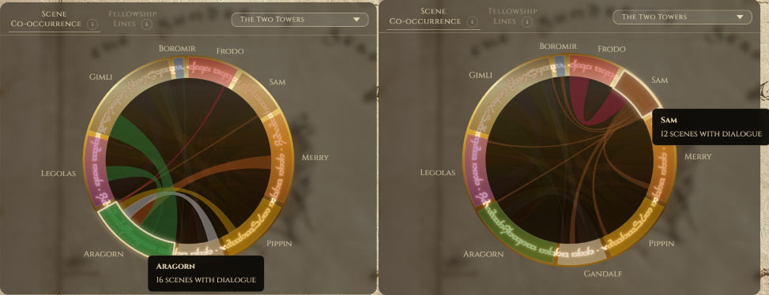

The scene co-occurrence chord graph is also very useful in drawing similar conclusions. In the Two Towers, Aragorn shares scenes with almost entirely Gimli and Legolas. Frodo and Sam frequently show up together in the Two Towers and Return of the King.

These conclusions might seem obvious to anyone familiar with the story, but I bring it up to show that this application brings out the best of the Lord of the Rings in terms of its writing, dialogue, and story-telling. The dashboard allows the user to appreciate the story from new angles.

### Surprising Line Counts

Frodo is the main protagonist of the trilogy, but the line count data reveals some patterns that do not align with this 1-to-1 and provides us with some insights.

To start, Gandalf leads the fellowship in total lines spoken across the trilogy, a semi-surprising result given that he is absent from a substantial portions of the first two movies. The explanation for this can be seen when checking out Gandalf's scene presence heatmap and seeing how dense in lines of text a lot of the scenes he did appear in were. This accounts for the offset in his absence.

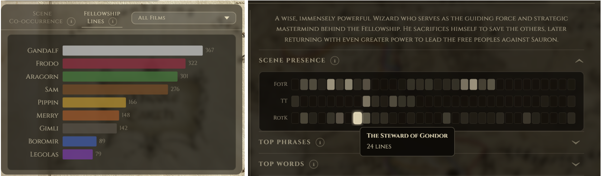

Another revealing aspect is the shift between Frodo and Sam over the course of the trilogy. In first movie, Frodo dominates the dialogue between the pair. But in the second movie, that dynamic starts to switch and Sam starts to talk a little more than Frodo. By the last movie, Sam dominates the pair in lines spoken. This mirrors the narrative arcs of these two, as the Ring starts to consume Frodo, making him become more reserved, Sam steps into the vocal anchor and source of hope for the pair. Portraying that underlying emotional shift in the pair through quantitative data with some context.

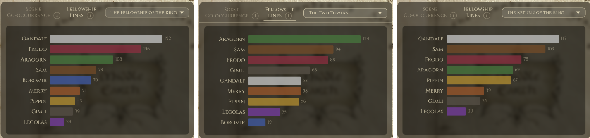

## Technical Implementation

### Tech Stack

#### Python (Data Exploration)

**Tools & Packages:** [`BeautifulSoup`](https://beautiful-soup-4.readthedocs.io/en/latest/), [`Requests`](https://requests.readthedocs.io/en/latest/), [`Natural Language Toolkit (NLTK)`](https://www.nltk.org/)

Python was used for the data pipeline primarily due to its ability to easily read and edit CSV data. The third party `Requests` library was used to interact with the online transcripts. `BeautifulSoup` and `NLTK` were used to process the language data.

#### JavaScript, HTML, CSS (Frontend)

**Packages:** [`D3.js`](https://d3js.org/)

`D3.js` was selected for its powerful capabilities in creating data visualizations. Using the basic frontend setup with D3 offered parity with what was taught in class and provided examples and allowed for granular control over the visualizations.

### Architecture

#### `data/`

Contains the CSV files, a Python scripts used to scrape and process the data, as well as the images and font used for the frontend.

#### `js/` (JavaScript)

Contains some class-based visualizations modules (`CharacterChord`, `HorizontalBarChart`, `InfoPanel`, `CharacterWords`, etc.). Also contains files for functions like placing the map markers and changing scenes.

#### `css/` (CSS)

Contains the style sheet files for styling our application.

### Running Locally

To run this locally:

1. Clone the repository and navigate to the directory

    ```bash
    git clone https://github.com/MatthewGoldsberry/Movie-Time.git
    cd Movie-Time
    ```

2. Launch a local web server (We used Python to do this)

    ```bash
    python -m http.server
    ```

3. Access the application at [`http://localhost:8000`](http://localhost:8000)

## Challenges & Future Work

### Challenges

There were a couple of distinct challenges encountered in this project. And they all can be generalized into three categories, data collection, data interpretation, and effective visualizations. These often went hand in hand with trying to figure out how to interpret AND represent the data from what we had collected in the most effective manner.

The most difficult part of the data collection process was collecting the location data. The transcript website often included the locations of each scene, but oftentimes general location names rather than specific references. Automating the location data mining proved difficult. Not only did we want specific locations for each character in each scene, we also needed those locations to be in terms of coordinates on our map of Middle Earth. We ultimately decided to do this data collection by hand by developing a draggable map marker that would output cx, cy values for the svg map and adding those values to the csv file. We leveraged some outside resources like the interactive map mentioned above to research these specific locations. Not only was this time consuming, but the way that this data was collected and organized impacted how we could visualize and interpret it later on.

When it came to data interpretation, one of the hardest changes was trying to programmatically determine top phrases of each character. How do you even effectively label something as a phrase and not just a random collection of words? Then how do you determine from that which of those "phrases" are unique / identifiable with that character? For this problem we decided that a phrase could be any grouping of consecutive words within a sentence of length 2-8. From these we than tried to mathematically determine some level of uniqueness score to it between all of the characters and then grabbed the most visible frequently occurring ones. Then to make it to the word cloud representation of these, there had to be more than 3 occurrences of that phrase. This approach was aided by AI and some reading, but ultimately got capped at some point due to complexity and time constraints. This provides some insightful findings but doesn't one hundred percent accomplish what a standard expectation would be for the question "What are common phrases of the characters". This is a big thing that we want to look at in future work.

Site coloring also proved to be a tricky challenge throughout this project too. We wanted a theme that matched the ancient map idea which mean a lot of shades of brown and more toned down colors. This becomes a major problem with color theory because of need to distinctiveness and visibility. For this project there was a lot of trying to strike the right balance in tradeoffs between keeping it visually pleasing and aligned with the goal them, while trying to best follow the guidelines of color theory. This also proved difficult from the sense of needing a lot more CSS elements because there needed to be layers to effectively visualize some of the things and features distinctively which a more monotone color setup.

### Future Work

* **Improved Top Phrase Identification:** This was mentioned in our [challenges](#challenges) section but this is something that would be very insightful and beneficial to get in a better state from both a user perspective, and for us to be able to learn those concepts surrounding NLP.
* **Improved Path Representation:** The LotR is all over the place in terms of character locations, they travel a lot. A bi-product of this and the time constraints meant the map representations could not be 100% down to the exact location or path taken. Specifically making the paths more exact would be an extremely cool feature to have down to be able to know the exact routes of the fellowship.
* **Improved Character Representation on Map:** We currently only show the characters that are in the scene on the map. Another great feature would be carefully orchestrating all character nodes on the map at once, regardless of if they are in the scene or not, and passively update their location if they are moving in the background.
* **Data-Specific Timeline:** The scene slider is super beneficial for high level looks at the text analysis, but it would be another layer of information if we could change the slider to be days and be able to provide a better temporal understanding of the characters location and journey over time. These could then be binned by the scene that they are in for determination of the higher-level textual analysis of the scenes and characters.
* **Addition of More Characters:** There are a lot of characters that were not represented in this visualization. Expanding beyond just the fellowship would be beneficial for further text analysis and understanding, and would be awesome when paired with the improved character orchestration on the maps and being able to properly play out the scenes.
* **Scene-Level View:** To make the scene player more accurate in depicting who is talking to who, it would be beneficial to support a zoomed in view where character locations could more accurately depicting so natural groupings within scenes can be seen.
* **Improved Representation Accuracy:** Right now a lot of stats, such as scenes present are based on the character saying a line in that scene, this is not always the case in movies. It is possible, and likely that there are characters in scenes that do not have any lines for that specific scene.

## Acknowledgements & AI Usage

We would like to extend our appreciation to Dr. Aurisano for providing valuable feedback and guidance on some visualization best-practice questions we had.

### Matthew Goldsberry

During the project, I leveraged Claude Code as an assistant. It primarily helped me accelerate the generation of some of the visual styling by writing CSS based on provided descriptions of vision and troubleshooting bugs that stumped me. I also leveraged it to help with some of hte logic required for aggregating data into the visualizations from the read in CSV data, such as with top phrases for each character. This allowed me to maintain a rapid development pace overall by dealing with these items that would normally be speed bumps.

Additionally, Gemini was used to construct some assets in the project. Specifically the character icons, favicon, and image in the repo where generated using Gemini Nano Banana. Then the character descriptions and scene summaries where originally generated via Gemini before being annotated by myself. This also served the purpose of rapidly getting this information in with the given time constraints.

I did not receive any non-AI help from outside this team during the project.

### Isaac Dowdy

I used GitHub Copilot line edits, autocomplete, and chat (mostly using claude sonnet 4.5) features to code more quickly, help brainstorm how to implement certain features, and find any loose ends or bugs across the workspace. AI was not only useful to speed up the work I did in this project, but also to allow this team to reach higher goals and achieve more deliverables than we could have without it.

I did not receive any help from other peers or classmates outside of this team.

## Team Contributions

### Matthew Goldsberry

* **Scene Info Panel** - per-scene dialogue breakdown showing which characters spoke and what they said
* **Character Info Panel** - three visualizations and some metadata summarizing the selected character's dialogue patterns and presence across all three films
* **Visualization Panel** - scene co-occurrence chord chart showing how often characters shared scenes, and a bar chart of total lines spoken per character
* **Contextual info icons** - tooltips throughout the application explaining data sources, methodology, and how to use the application

### Isaac Dowdy

* **Data pipeline** - scraped and parsed all dialogue from the source transcripts into a usable, structured CSV
* **Scene player** - animated playback of scenes showing character dialogue appearing above their map nodes in real time
* **Scene timeline** - temporal navigation bar spanning all three films, allowing users to jump to any scene and an animation to sequentially go through them
* **Map character visualization** - dynamic character placement on the Middle Earth map that updates position and path history as the selected scene changes

### Joint Efforts

* Initial project planning and conceptualization
* UI/UX design and dashboard layout decisions
* Documentation
